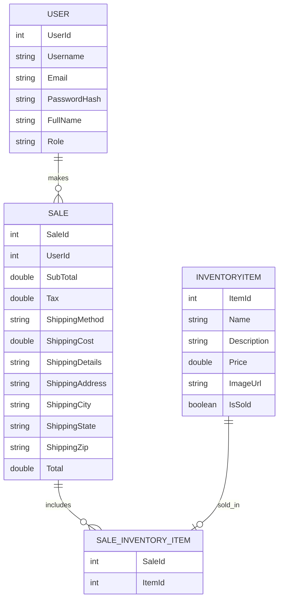

# Technical Design


<!-- TABLE OF CONTENTS -->
<details>
  <summary>Table of Contents</summary>
  <ol>
    <li><a href="#implementation-language">Implementation Language</a></li>
    <li><a href="#implementation-framework">Implementation Framework</a></li>
    <li><a href="#data-storage-plan">Data Storage Plan</a></li>
    <li><a href="#entity-relationship-diagram">Entity Relationship Diagram</a></li>
    <li><a href="#entity/field-descriptions">Entity/Field Descriptions</a></li>
    <li><a href="#data-examples">Data Examples</a></li>
    <li><a href="#database-seed-data">Database Seed Data</a></li>
    <li><a href="#authentication-and-authorization-plan">Authentication and Authorization Plan</a></li>
    <li><a href="#coding-style-guide">Coding Style Guide</a></li>
    <li><a href="#technical-design-presentation">Technical Design Presentation</a></li>
  </ol>
</details>


<a id="implementation-language"></a>
# :book: Implementation Language
#### Why we selected Java 
- Our members have strong experience in programming in Java
- It is very resourceful, and it includes many libraires, Q&A support, and debugging tools
- Java is a common language used by developers to build web applications
- Reliable language to share code and work in groups

#### Ways we will implement it
- Developing the backend logic such as adding inventory items
- Set up and manage data models like Item, Sale, and Category, and connect them to the database with respitories.
- Powers the server side of the online thrift store with Spring Boot

#### Documentation and useful tutorials for Java
- Main website: https://dev.java/
- Java tutorial: https://www.w3schools.com/java/
- Java APIs: https://devdocs.io/openjdk~17/?utm_source=chatgpt.com

#### Why and how we will use HTML and CSS
- Create the frontend of the African Jewelry Shop using HTML for structure and CSS for styling
- Apply the UI/UX design that was created through Marvel to the HTML pages for good user experience.

#### Documentation and useful tutorials for HTML + CSS
- HTML:  https://www.w3schools.com/html/
- CSS:  https://www.w3schools.com/Css/

<p align="right">(<a href="#readme-top">back to top</a>)</p>


<a id="#implementation-framework"></a>
# :atom_symbol: Implementation Framework

#### Why we selected Spring Boot
- Provides a programming model for Java-based applications
- Supports web apps, REST APIs, microservices, security and cloud deployment
- Creates stand-alone application
- Handles required internal dependencies

#### Ways we will implement it
- Use Spring's controllers to return HTML pages
- Receive requests from user such as changing screens and completing purchase
- Create and store items as objects and sends information to database

#### Documentation and useful tutorials for Spring Boot
- Main website: https://spring.io/projects/spring-boot
- Spring Boot Tutorial: https://www.geeksforgeeks.org/advance-java/spring-boot/

#### Why and how we will use Thymeleaf
- Allows the HTML to display data from Java such as item information (name, image, price), sales, and user type (user, admin)
- Integrates Java and Spring Boot 

#### Documentation and useful tutorials for Thymeleaf
- Main website: https://www.thymeleaf.org/
- Thymeleaf tutorial: https://www.geeksforgeeks.org/java/spring-boot-thymeleaf-with-example/

<p align="right">(<a href="#readme-top">back to top</a>)</p>


<a id="data-storage-plan"></a>
# :people_holding_hands: Data Storage Plan


  
<p align="right">(<a href="#readme-top">back to top</a>)</p>


<a id="entity-relationship-diagram"></a>
# :link: Entity Relationship Diagram



<p align="right">(<a href="#readme-top">back to top</a>)</p>

<a id="entity/field-descriptions"></a>
# :book: Entity/Field Descriptions

| Property            | Type             | Required      | Key Type     |  Notes                                              |
| ------------------- | ---------------- | --------------|-------------|----------------------------------------------------  |
| UserId           | INTEGER            | ✔️             | PK           | Unique identifier for each user. Auto-incremented.        |
| Username         | NVARCHAR(100)      | ✔️             | —            | Required and unique username for each user.               |
| Email            | NVARCHAR(100)      | ✔️             | —            | User email address for contact.                           |
| Passwordhash     | NVARCHAR(255)      | ✔️             | —            | Hashed password for authentication.                       |
| FullName         | NVARCHAR(50)       | ✔️             | —            | User’s full name (first + last).                          |
| Role             | CHAR               | ✔️             | —            | Indicates if user is an admin ('admin') or customer ('user'). |
| ItemId           | INTEGER            | ✔️             | PK           | Unique identifier for each jewelry item. Auto-incremented. |
| Name             | NVARCHAR(100)      | ✔️             | —            | Jewelry item name.                                       |
| Description      | NVARCHAR(255)      | ⬜             | —            | Description of the jewelry item.                         |
| Price            | NVARCHAR(50)       | ✔️             | —            | Item price in USD.                                       |
| ImageURL         | BOOLEAN            | ✔️             | —            | URL to item's image.                                     |
| IsSold           | BOOLEAN            | ✔️             | —            | Indicates if the item has been sold.                     |
| SaleId               | INTEGER            | ✔️             | PK           | Unique identifier for each sale. Auto-incremented.           |
| UserId               | INTEGER            | ✔️             | —            | ID of the user who made the purchase.                        |
| SubTotal             | Decimal            | ✔️             | —            | Total cost of items before tax and shipping.                 |
| Tax                  | Decimal            | ✔️             | —            | Tax applied to the sale.                                     |
| ShippingMethod       | NVARCHAR(255)      | ✔️             | —            | Shipping option chosen (Overnight, 3-Day, Ground).           |
| ShippingCost         | Decimal            | ✔️             | —            | Cost of the selected shipping method.                        |
| ShippingDetails      | NVARCHAR(255)      | ⬜             | —            | Optional instructions or delivery notes.                     |
| ShippingAddress      | NVARCHAR(255)      | ✔️             | —            | Street address for shipping.                                 |
| ShippingCity         | NVARCHAR(255)      | ✔️             | —            | City for shipping.                                           |
| ShippingState        | NVARCHAR(255)      | ✔️             | —            | State for shipping.                                          |
| ShippingZip          | NVARCHAR(255)      | ✔️             | —            | ZIP code for shipping.                                       |
| Total                | Decimal            | ✔️             | —            | Final total including items, tax, and shipping.              |
| SaleId         | INTEGER       | ✔️             | FK → Sale(SaleId)              | References the Sale table.            |
| ItemId         | INTEGER       | ✔️             | FK → InventoryItem(ItemId)     | References the InventoryItem table.   |


<p align="right">(<a href="#readme-top">back to top</a>)</p>


<a id="#data-examples"></a>
# :atom_symbol: Data Examples


<p align="right">(<a href="#readme-top">back to top</a>)</p>


<a id="database-seed-data"></a>
# :people_holding_hands: Database Seed Data


  
<p align="right">(<a href="#readme-top">back to top</a>)</p>


<a id="authentication-and-authorization-plan"></a>
# :link: Authentication and Authorization Plan

## 1. Overall Approach
We’ll use role-based access control (RBAC) with a single User model and a Role concept:
- Every authenticated person is a User.
- An Administrator is just a User with role = ADMIN.
- There is one login screen; after login, the system inspects the user’s role to decide:
    • which UI elements to show (e.g., “Sales Report”, “Promote User”),
    • which backend endpoints they’re allowed to call.
  
**Technologies:**
Backend: Java + Spring Boot
Persistence: Spring Data JPA + SQLite
Security: Spring Security (or a light custom equivalent), HTTP session-based for V1

## 2. Data Model
### 2.1 USER Table

| Column              | Type             |   Notes                                    |
| ------------------- | ---------------- | -----------------------------------------  |
| Userid              | INTEGER PK       | Auto_Increment primary key                 |
| Username            | TEXT UNIQUE      | Required, Unique                           |
| email               | TEXT             | Required for account recovery              |
| Full name           | TEXT             | User's full name                           |
| password_hash       | TEXT             | BCrypt hash of password (min 6 chars)      |
| role                | TEXT             | 'USER' or 'ADMIN'                          |


### 2.2 Java Domain Model
```sh
public enum Role {
    USER,
    ADMIN
}

@Entity
@Table(name = "users")
public class User {

    @Id @GeneratedValue(strategy = GenerationType.IDENTITY)
    private Long id;

    @Column(nullable = false, unique = true)
    private String username;

    @Column(nullable = false)
    private String passwordHash;

    @Enumerated(EnumType.STRING)
    @Column(nullable = false)
    private Role role = Role.USER; // default

    // constructors, getters, setters

    public boolean isAdmin() {
        return this.role == Role.ADMIN;
    }
}
```

Initial admins are seeded via an SQL script or data initializer instead of the registration screen to satisfy the "Admins cannot self-register" requirement

## 3. Authentication Flow

### 3.1 Registration (T1S-1: Register a New User)
Requirement:
```sh
   “The user must be able to self-register… Admins cannot self-register.”
```

Implementation:
- Endpoint: POST /auth/register
- Request body: { username, password, confirmPassword }
- Validation:
    - username is unique
    - password length ≥ 6
- The role is not accepted from client; it is forced to Role.USER on server.
```sh
public User registerUser(RegisterRequest req) {
    if (userRepository.existsByUsername(req.getUsername())) {
        throw new DuplicateUsernameException();
    }
    if (req.getPassword().length() < 6) {
        throw new WeakPasswordException();
    }

    User user = new User();
    user.setUsername(req.getUsername());
    user.setPasswordHash(passwordEncoder.encode(req.getPassword()));
    user.setRole(Role.USER); // enforce regular user

    return userRepository.save(user);
}

```

### 3.2 Login (T1S-2: Log in as a Registered User)
Requirement:
```sh
“The user must be able to log in using their registered credentials… direct the user to the main inventory screen upon success.”
```

Implementation:
- Single login screen: POST /auth/login
- Spring Security (or custom) validates credentials.
- On success:
    - Populate SecurityContext / HttpSession with userId and role.
    - Redirect to /inventory (jewelry list).
      
Example(Custom service):
```sh
public User authenticate(String username, String rawPassword) {
    User user = userRepository.findByUsername(username)
        .orElseThrow(BadCredentialsException::new);

    if (!passwordEncoder.matches(rawPassword, user.getPasswordHash())) {
        throw new BadCredentialsException();
    }
    return user;
}

```

Controller:
```sh
@PostMapping("/auth/login")
public String login(@ModelAttribute LoginRequest req, HttpSession session) {
    User user = authService.authenticate(req.getUsername(), req.getPassword());
    session.setAttribute("userId", user.getId());
    session.setAttribute("role", user.getRole());
    return "redirect:/inventory";
}

```

No separate admin login page; same endpoint, different behavior once logged in.

## 4. Authorization Design (What Each Role Can Do)

Regular User can:  
view inventory, search by name, add to cart, checkout, see their receipt 
Admin can additionally: 
log in as admin and promote a regular user to admin (T1S-9) 
view sales report (T1S-11) and individual receipts (T1S-12)

### 4.1 Backend Authorization
We enforce role checks in the controller/service layer.
If using Spring Security:
```sh
@Configuration
@EnableWebSecurity
public class SecurityConfig {

    @Bean
    public SecurityFilterChain filterChain(HttpSecurity http) throws Exception {
        http
          .authorizeHttpRequests(auth -> auth
             .requestMatchers("/auth/**", "/static/**").permitAll()
             .requestMatchers("/admin/**").hasRole("ADMIN")
             .requestMatchers("/inventory/**", "/cart/**", "/orders/**").hasRole("USER")
             .anyRequest().authenticated()
          )
          .formLogin(form -> form
             .loginPage("/login")
             .defaultSuccessUrl("/inventory", true)
          );

        return http.build();
    }
}
```

### 4.2 UI-Level Authorization
- After login, front-end fetches /auth/me returning { username, role }.
- Navigation bar conditionally renders:
    - If role == USER → show: Inventory, Cart, Checkout.
    - If role == ADMIN → show: Inventory, Cart + Admin Dashboard, Sales Report, User Management.

This ensures the actions presented to each logged-in user are aligned with their authorization.

## 5. Admin Promotion (T1S-9)
Requirement:
```sh
“Only existing admins can log in and transform a regular user into an admin.”
We’ll implement a simple Admin User Management use case:
```

### 5.1 Endpoint
- GET /admin/users – list users (ADMIN only)
- POST /admin/users/{id}/promote – change role USER→ADMIN
- Service:
```sh
public void promoteToAdmin(Long targetUserId, User actingAdmin) {
    if (!actingAdmin.isAdmin()) {
        throw new AccessDeniedException("Only admins can promote users");
    }

    User target = userRepository.findById(targetUserId)
        .orElseThrow(UserNotFoundException::new);

    if (target.isAdmin()) {
        return; // already admin
    }

    target.setRole(Role.ADMIN);
    userRepository.save(target);
}
```

Controller example:
```sh
@PostMapping("/admin/users/{id}/promote")
public String promote(@PathVariable Long id, HttpSession session) {
    Long actingId = (Long) session.getAttribute("userId");
    User acting = userService.getById(actingId);

    adminService.promoteToAdmin(id, acting);
    return "redirect:/admin/users";
}
```

This directly implements the “transform regular user into admin” requirement.

## 7. Summary

- Authentication
    - Single login UI (/auth/login) for both Users and Admins.
    - Registration (/auth/register) always creates role = USER.
    - Passwords stored as BCrypt hashes.
    - Session stores userId and role.
      
- Authorization
    - Enforced both in backend (role checks / @PreAuthorize / URL mapping) and frontend (conditional rendering).
    - Role.USER:
        - View inventory, search, add to cart, checkout, see receipts.
    - Role.ADMIN:
        - All user actions plus:
        - View sales report.
        - View individual receipts.
        - Promote other users to admin.

- Admin is just a User with role = ADMIN
    - No second login form.
    - Same User entity and users table.
    - Role field and helper methods (isAdmin()) drive access decisions.

<p align="right">(<a href="#readme-top">back to top</a>)</p>

<a id="coding-style-guide"></a>
# :people_holding_hands: Coding Style Guide

To ensure that our application is maintainable, consistent, and easy for all team members to understand, we will follow a standard coding style. We also reference Cornell’s Java Style Guide for additional clarity and examples:
 Source: Cornell University Java Programming & Style Guide
 https://www.cs.cornell.edu/courses/JavaAndDS/JavaStyle.html
General Principles
- Code should be written so another beginner could read and understand it.
- Use clear, descriptive names for all variables, classes, and methods.
-Keep each function or method focused on one purpose.
-Add comments whenever logic is not obvious.
-Do not leave unused code or debug print statements in submitted versions.
Naming Conventions
- Classes: PascalCase
User, InventoryItem, SaleManager
- Methods: camelCase
calculateTotal(), addItemToCart(), loginUser()
- Variables: camelCase
userName, itemPrice, shippingMethod
- Constants: UPPER_CASE
TAX_RATE, MAX_CART_SIZE
Formatting
- Indentation: 2 spaces.
- Use single quotes for strings: 'example'.
- Use semicolons at the end of each statement.
- Opening brace on the same line as the statement:
- For example:
 if (isValid) {
  return true;
}
Comments
- Use comments to explain why, not what.
- Use JavaDoc comments for functions:
 /**
 * Calculates tax for a subtotal
 */
Database (SQLite / SQL) Style Guide
	Referencing “https://www.sqlstyle.guide/”
Table Names
- Use PascalCase for table names: User, InventoryItem, Sale, SaleInventoryItem
- Keep names singular, not plural
Column Names
- Use camelCase for columns: userId, fullName, isSold, shippingAddress
- Primary keys always use Id suffix: UserId, ItemId, SaleId
- Foreign keys match the referenced table name: UserId, ItemId
Data Types
- Use INTEGER for IDs and whole numbers
- Use REAL for prices or decimal values (REAL is SQLite’s closest to decimal/currency)
- Use TEXT for strings, including names, descriptions, and addresses
- Use BOOLEAN (stored as 0 or 1) for true/false fields like isAdmin or isSold
Constraints
- Required fields: NOT NULL (e.g., username, password, shippingAddress)
- Primary key: PRIMARY KEY
- Foreign keys: REFERENCES OtherTable(columnName)
- SQLite does not enforce types strictly, so naming conventions and NOT NULL constraints are important


Junction / Linking Tables
- Use a combination of the two related tables’ names: SaleInventoryItem
- Include both foreign keys: SaleId and ItemId
Version Control & Repository Management
 Platform
- GitHub
Repository Structure
Main repository example:
 swe-3313-fall-2025-team-01
Branches
main – final, stable project code
dev – where all features are combined and tested
feature branches – one branch per task (e.g., feature/T1S-1-registration)
database – database schema and ERD updates (optional)
Workflow
All changes must go through a Pull Request (PR)
PRs require at least one team member approval
Fix merge conflicts before requesting approval
Delete feature branch after merging
Commit Conventions
Format:
 [Type] Short description
 Types:
feat – new feature
fix – bug fix
refactor – code clean-up
test – adding tests
Example:
 [feat] Implement jewelry search by name
Code Review Requirements
Before approving a Pull Request:
Check if naming conventions were followed
Ensure code is readable and commented where needed
Verify the code matches the requirements for its epic/story
Ensure no debugging outputs are left
Confirm no broken formatting or unused variables

  
<p align="right">(<a href="#readme-top">back to top</a>)</p>


<a id="technical-design-presentation"></a>
# :link: Technical Design Presentation


<p align="right">(<a href="#readme-top">back to top</a>)</p>
